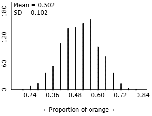
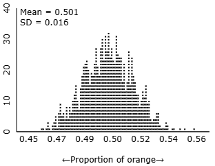
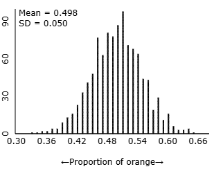

```{r}
library(tidyverse)
options(scipen = 999)
```

\newcommand{\blank}{\rule{2.5cm}{0.15mm}}

\vspace*{-2cm}

Name:\_\_\_\_\_\_\_\_\_\_\_\_\_\_\_\_\_\_\_\_\_\_\_\_\_\_\_\_\_\_\_\_\_ Date:\_\_\_\_\_\_\_\_\_\_\_\_\_\_\_

## Learning goals for today

By the end of this lecture, you should be able to:

- Define and identify parameter, statistic, and point estimate.
- Explain why estimates vary from sample to sample (sampling variability).
- Describe what a sampling distribution is (conceptually).
- Compute and interpret the standard error of $p$
- Check when a normal model for $p$ is reasonable (independence + success–failure).


## Vocabulary

\begin{center}
\begin{tabular}{p{0.35\textwidth} p{0.65\textwidth}}
\textbf{Terms} & \textbf{Descriptions} \\[0.3em]

1. Parameter \hfill \rule{1cm}{0.15mm}
& A. A value describing a characteristic of a sample. \\[0.6em]

2. Statistic \hfill \rule{1cm}{0.15mm}
& B. A systematic tendency to over or underestimate a  parameter \\[0.6em]

3. Point Estimate \hfill \rule{1cm}{0.15mm}
& C. A value describing a characteristic of a population, usually unknown. \\[0.6em]

4. Sampling distribution \hfill \rule{1cm}{0.15mm}
& D. A value computed from a sample that serves to approximate an unknown population value  \\[0.6em]

2. Bias \hfill \rule{1cm}{0.15mm}
& B. A density of all possible values a statistic can take from collecting multiple samples of the same size. \\[0.6em]

4.  \hfill \rule{1cm}{0.15mm}
& F. Standard deviation of a point estimate.  \\[0.6em]

\end{tabular}
\end{center}

Circle whether each is a parameter or statistic:

1. $p$ = true proportion of CSUCI students who commute: Parameter / Statistic
2. $\hat{p}$ from a survey of 80 CSUCI students: Parameter / Statistic
3. $\mu$ = true mean height of all CSUCI students: Parameter / Statistic
4. $\bar{x}$ from a sample of 30 students: Parameter / Statistic

If I collected a sample from 80 CSUCI students and and calculated the proportion that commute $\hat{p}$, do you think it will exactly equal $p$? If not, how different do you think it will be?


\vspace{3cm}

If I were to collect another sample of 80 CSUCI students and compute $\hat{p}$ for that sample, do you think this $\hat{p}$ would exactly equal $p$ or the first $\hat{p}$? If not, how different do you think it will be?


\vspace{3cm}


## Orange candies

Suppose I am a picky eater and only like to eat the orange Reese's Pieces candy. I'm curious about what proportion of the candies are orange, and I am going to collect samples to try to understand this. Visit this applet: <https://www.rossmanchance.com/applets/2021/oneprop/OneProp.htm?candy=1>

1.) Start by setting "Probability of orange" = 0.5, "Number of candies" = 25,  "Number of samples" = 1 (Should be the default). Click "Draw Samples". Specify the following values:

- $p$ = 

- $n$ = 

- $\hat{p}$ = 

- Error = $p$ - $\hat{p}$ = 

2.) After a sample is collected it is thrown back into the candy machine. Click "Draw Samples" again to collect another sample of 25 candies.
Specify the following values:

- $p$ = 

- $n$ = 

- $\hat{p}$ = 

- Error = $p$ - $\hat{p}$ = 

3. Click "Draw Samples" one more time and specify the following values:

- $p$ = 

- $n$ = 

- $\hat{p}$ = 

- Error = $p$ - $\hat{p}$ = 

4.) Now change "Number of samples" to 10, uncheck the "Show animation" box, and under "Choose statistic" set it to "Proportion of orange". Click "Draw Samples". 

Check the "Normal Approximation" under "Options". What would you approximate the average value of $\hat{p}$ to be?

\newpage

5.) Check the "Summary Statistics" box and record:

- mean of $\hat{p}$'s = 
- standard deviation $\hat{p}$'s = 

6.) We are now going to collect a much larger number of samples. Set "Number of samples" to 50 and click "Draw Samples". 

The plot is showing a histogram of the $\hat{p}$'s calculate from each sample. How would you describe the (sampling) distribution?

\vspace{3cm}

7.) Record:

- mean of $\hat{p}$'s = 
- standard deviation $\hat{p}$'s = 

8.) Finally, increase the "Number of samples" to 1000 and click "Draw Samples". Record:

- mean of $\hat{p}$'s = 
- standard deviation $\hat{p}$'s = 

How did the mean and standard deviation of $\hat{p}$ change as we collected more samples? 

\vspace{3cm}


Below are three histograms of the sampling distribution for $\hat{p}$ all created with $p = 0.5$ and 1063 samples collected each time. The only difference is the number of candies collected in each sample. In one scenario 25 candies were collected each time ($n$), in another 100 candies were sampled each time, and 1000 candies were collected each time in the final case. Identify each plot below as either $n = 25$, $n = 100$, $n = 1000$.

::: {layout-ncol=3}







:::

Which scenario provided more accurate estimates of $p$? Explain your answer.


\newpage 

## Standard error of $\hat p$

The standard deviation of the sampling distribution of $\hat p$ is called the **standard error**.

$$
SE_{\hat p}=\sqrt{\frac{p(1-p)}{n}}
$$

Since we usually don’t know $p$, we often use the **plug-in** estimate:

$$
SE_{\hat p}\approx \sqrt{\frac{\hat p(1-\hat p)}{n}}
$$


## Guided practice: how does sample size affect variability?

Suppose $p = 0.50$.

1. Compute $SE_{\hat p}$ when $n=25$:

$$
SE_{\hat p}=\sqrt{\frac{0.5(0.5)}{25}}=\blank
$$

2. Compute $SE_{\hat p}$ when $n=100$:

$$
SE_{\hat p}=\sqrt{\frac{0.5(0.5)}{100}}=\blank
$$

3. Which sample size gives a more **precise** estimate? Why?

\vspace{1.2cm}

## Sampling distribution

The distribution of sample proportions $\hat{p}$ is called the _________________________. In real life it is not actually observed, because we typically only collect one sample, so we should be aware that there is variability in $\hat{p}$. (Fill in the blank.)

For each of the following, circle the option that completes the statement.

- If we were to collect a lot of samples the mean of $\hat{p}$'s will be a **more / less** accurate estimate for the true population parameter $p$.

- If we were to collect a lot of samples the standard deviation of $\hat{p}$'s will be **smaller / larger**. 

- If we increase the size of our sample, $n$, our point estimates $\hat{p}$ will become a **more / less** accurate estimate for the true population parameter $p$.

\newpage

## When is $\hat p$ approximately normal?

The sampling distribution of $\hat p$ tends to be approximately normal when:

### Condition 1: Independence

Each observation in the sample should be an independent draw from the population. The most common way for observations to be considered independent is if they are from a simple random sample.

### Condition 2: Success–failure condition

$$
np \ge 10 \quad \text{and} \quad n(1-p)\ge 10
$$
Since $p$ is unknown, we often check using $\hat p$:

$$
n\hat p \ge 10 \quad \text{and} \quad n(1-\hat p)\ge 10
$$


Example: Check the conditions

A health department wants to estimate the proportion of households in a town that test positive for elevated lead levels. They take a random sample of $n$ = 40 households. Only 2 households test positive.

Compute:

- $\hat{p} =$

- $n\hat p=$
- $n(1-\hat p)=$

Is the success–failure condition satisfied?: **Yes / No**

Independence: **Yes / No**

## Connecting to normal distributions & z-scores (preview)

If the conditions are met, we can model:

$$
\hat p \sim N(\mu=p, \sigma = \sqrt{\frac{p(1 - p)}{n}})
$$

This will let us estimate probabilities like:

- “How likely is $\hat p$ to be within 0.02 of $p$?”
- “How surprising is our sample result if the true proportion were 0.50?”

(We will use z-scores and normal probabilities for these soon.)

