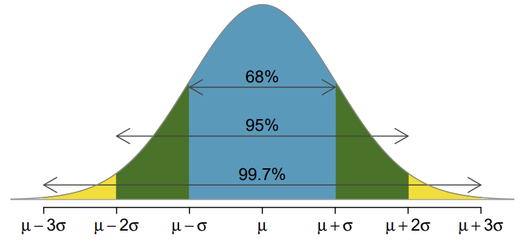

```{r}
library(tidyverse)
options(scipen = 999)
```

\newcommand{\blank}{\rule{2.5cm}{0.15mm}}

\vspace*{-2cm}

Name:\_\_\_\_\_\_\_\_\_\_\_\_\_\_\_\_\_\_\_\_\_\_\_\_\_\_\_\_\_\_\_\_\_ Date:\_\_\_\_\_\_\_\_\_\_\_\_\_\_\_

## Learning goals for today

By the end of this lecture, you should be able to:

- Explain how changing the confidence level affects interval width.
- Construct confidence intervals with different confidence levels.
- Define null and alternative hypotheses.
- Use a confidence interval to evaluate a hypothesis test.
- Interpret Type I and Type II errors in context.

## Changing the confidence level

Last class we constructed 95% confidence interval:
$$\hat{p} \pm 1.96 * SE$$
To interpret this confidence interval we can say we are 95% that the true population proportion lies between $\hat{p} - 1.96 * SE$ and $\hat{p} + 1.96 * SE$. Let's recall why we use 1.96 in our margin of error? For a normal distribution:

```{r}
#| fig-align: center
#| fig-height: 1
#| fig-width: 5
# Create x values
x <- seq(-4, 4, length.out = 500)

# Standard normal density
df <- data.frame(
  x = x,
  y = dnorm(x)
)

blank_normal <- ggplot(df, aes(x = x, y = y)) +
  geom_line(linewidth = 1.3) +

  # Only one tick at 0 labeled mu
  # scale_x_continuous(
  #   breaks = 0,
  #   labels = "",
  #   expand = c(0.02, 0.02)
  # ) +
  
  # Remove y-axis ticks and labels
  scale_y_continuous(breaks = NULL) +
  
  theme_classic(base_size = 14) +
  theme(
    axis.title = element_blank(),
    axis.text.y = element_blank(),
    axis.ticks.y = element_blank(),
    axis.line.y = element_blank(),
    axis.ticks.x = element_blank(),
    axis.text.x = element_blank()
  )

gridExtra::grid.arrange(
  blank_normal,
  blank_normal,
  nrow = 1
)
```

\vspace{1cm}

<!-- ```{r} -->
<!-- #| fig-align: center -->
<!-- #| fig-height: 2.5 -->
<!-- #| fig-width: 3 -->

<!--  -->
<!-- ``` -->

- Approximately 68% of the values are within _____ standard deviations of the mean.
- Approximately 95% of the values are within _____ standard deviations of the mean.
- Approximately 99.7% of the values are within _____ standard deviations of the mean.

What if we wanted the confidence interval to be more accurate (have higher confidence), based on the same data ($n,\hat{p})$? Should we make the confidence interval larger or smaller?

\newpage

The confidence level is long-run success rate of the interval containing the true population proportion $p$. What if I wanted to increase the long-run success rate to 99%?

```{r}
#| fig-align: left
#| fig-height: 1
#| fig-width: 2.5
blank_normal
```

\vspace{0.5cm}

Then our confidence interval would be:


**Confidence interval using any confidence level:**
$$\text{point estimate } \pm z^* \times SE,$$
Where $z^*$ corresponds to a specific confidence level and is the Z-score that cuts off the middle proportion of the the normal distribution. It can be computed using \newline
\hspace*{2cm} `qnrom(tail area, mean = 0, sq = 1)`, \newline
where tail area = 1 - (1 - confidence level) / 2.


### Ebola example

In New York City on October 23rd, 2014, a doctor who had recently been treating Ebola patients in Guinea went to the hospital with a slight fever and was subsequently diagnosed with Ebola. 
Soon thereafter, an NBC 4 New York/The Wall Street Journal/Marist Poll found that 82% of New Yorkers favored a "mandatory 21-day quarantine for anyone who has come in contact with an Ebola patient". 
This poll included responses of 1,042 New York adults between Oct 26th and 28th, 2014.

What is the point estimate in this case, and is it reasonable to use a normal distribution to model
that point estimate?

\vspace{1in}

What is the standard error of our point estimate?

\vspace{1in}

Construct a 99% confidence interval for $p$, the proportion of New York adults who supported a quarantine for anyone who has come into contact with an Ebola patient.

\vspace{1in}

Provide an interpretation for your calculated 99% confidence interval in context.

\vspace{1.5in}

## Formalizing hypotheses

Example: Suppose someone says there are aliens from another planet on our campus. 

- If we find an alien on campus, what should we conclude?

\vspace{1.5cm}

- If we don't find an alien on campus, what should we conclude?

\vspace{1.5cm}

In statistics formalize a situation into two possibilities, the **null hypothesis** ($H_0$) and the **alternative hypothesis** ($H_A$). 

- The null hypothesis represents skepticism, "status quo", or "no difference". 
- The alternative hypothesis represents the competing claim.

We assume the null hypothesis is true and see if we find evidence against it.

Example: A US court considers two possible claims about a defendant: she is either innocent or guilty. If we
set these claims up in a hypothesis framework, which would be the null hypothesis and which the
alternative?

\vspace{1in}

- If they jury finds convincing evidence of guilt, what should they conclude?

\vspace{1.5cm}

- If the jury is not convinced of guild beyond a reasonable doubt, what should they conclude?

\newpage

Example: Let's revisit the Ebola example. Suppose someone is claiming that the true proportion of New Yorkers that favored the a mandatory quarantine in 2014 was 79%. 

Specify $H_0$ and $H_A$.

\vspace{1in}

```{r}
n <- 1042
p_hat <- 0.82
se <- sqrt(p_hat * (1 - p_hat) / n)

ci_lb_99 <- p_hat - qnorm(1 - (1 - 0.99) / 2) * sqrt(p_hat * (1 - p_hat) / n)
ci_ub_99 <- p_hat + qnorm(1 - (1 - 0.99) / 2) * sqrt(p_hat * (1 - p_hat) / n)

ci_lb_90 <- p_hat - qnorm(1 - (1 - 0.9) / 2) * sqrt(p_hat * (1 - p_hat) / n)
ci_ub_90 <- p_hat + qnorm(1 - (1 - 0.9) / 2) * sqrt(p_hat * (1 - p_hat) / n)
```

Do we have evidence against the null hypothesis? What do we conclude?

\vspace{4in}


What if I told you that the 90% confidence interval was (`r round(ci_lb_90, 2)`, `r round(ci_ub_90, 2)`). Does that change anything?

