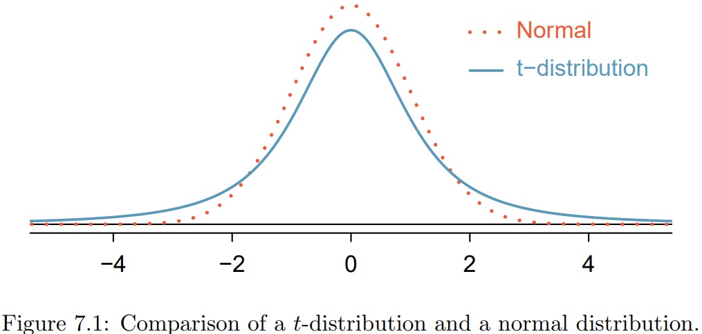

```{r}
library(tidyverse)
options(scipen = 999)
```

\newcommand{\blank}{\rule{2.5cm}{0.15mm}}

\vspace*{-2cm}

Name:\_\_\_\_\_\_\_\_\_\_\_\_\_\_\_\_\_\_\_\_\_\_\_\_\_\_\_\_\_\_\_\_\_ Date:\_\_\_\_\_\_\_\_\_\_\_\_\_\_\_

## Learning goals for today

By the end of this lecture, you should be able to:

- Describe how inference for means is similar to inference for proportions
- Explain why we use the t-distribution instead of the normal distribution
- Identify the standard error for a sample mean
- Check conditions for inference with a mean
- Construct and interpret a confidence interval for a population mean  

## Sampling distributions

Recall inference means to use a sample to infer about a population quantity (called a parameter).
Below are two sampling distributions that we have learned for inference concerning proportions. 
Today we will learn about inference for a mean.

| Population parameter (unknown) | Sample statistic (point estiamte) | Sampling distribution | Mean | Standard error |
|:--------------------|:--------------------|:-----------------|:------------|:-----------------------------|
| $p$ | $\hat{p}$ | Normal distribution | $p$ | $\sqrt{\frac{p \times (1 - p)}{n}}$ |
| $p_1 - p_2$ | $\hat{p}_1 - \hat{p}_2$ | Normal distribution | $p_1 - p_2$ | $\sqrt{\frac{p_1 \times (1 - p_1)}{n_1} + \frac{p_2 \times (1 - p_2)}{n_2}}$
| $\mu$ (known $\sigma$) | | | |
| | | | |
| | | | |
| $\mu$ (unknown $\sigma$) | | | |
| | | | |
| | | | |

Conditions for inference for $\mu$:

- **Independence:** The sample observations must be independent. To check this we will check if the data were collected as a simple random sample.
- **Normality:** 
  - Satisfied if $n < 30$ and there are no outliers
  - Satisfied if $n \geq 30$ and there are no extreme outliers

## $t$-distribution

Intuitively, when we want to do inference for a mean but do not know $\sigma$, we are adding uncertainty.
The $t$-distribution helps us better capture this uncertainty.

{width=5in height=1.75in fig-align="center"}

The **t-distribution**:

- Is similar in shape to the Normal, but with more probability for extreme values.
- Has only one parameter: **degrees of freedom**
  - The larger the degrees of freedom, the closer the $t$-distribution is to the mean.
- In R we can use the function `pt(x, df = ___)` to find probability of $t<x$.
- In R we can use the function `qt(y, df = ___)` to find the value that separates the lower y area from the upper 1-y area. Used for confidence intervals.

Exercise:  
Assume we have a variable $T$ which follows a $t$-distribution with 32 degrees of freedom. Compute each probability and shade the corresponding area under the curve.

```{r}
#| fig-align: center
#| fig-height: 1.5
#| fig-width: 6
# Create x values
x <- seq(-4, 4, length.out = 500)

# Standard normal density
df <- data.frame(
  x = x,
  y = dt(x, df = 32)
)

act_curve <- ggplot(df, aes(x = x, y = y)) +
  geom_line(linewidth = 1.3) +
  # scale_x_continuous(
  #   breaks = c(6, 9, 12, 15, 18, 21, 24, 27, 30, 33, 36),
  #   labels = c("", 9, "", 15, "", 21, "", 27, "", 33, "")
  # ) +
  scale_y_continuous(breaks = NULL) +
  theme_classic() +
  theme(
    axis.title = element_blank(),
    axis.text.y = element_blank(),
    axis.ticks.y = element_blank(),
    axis.line.y = element_blank()
    #axis.ticks.x = element_blank()
    #axis.text.x = element_blank()
  ) 

gridExtra::grid.arrange(
  act_curve + 
    labs(title = "P(T < 2)"),
  act_curve + 
    labs(title = "P(T > 2)"),
  act_curve  + 
    labs(title = "P(-2 < T) or P(T > 2)"),
  nrow = 1
)
```

\vspace*{0.5in}

Find the value of $t^*$ for the following confidence levels.
```{r}
#| fig-align: center
#| fig-height: 1.5
#| fig-width: 6
# Create x values
x <- seq(-4, 4, length.out = 500)

# Standard normal density
df <- data.frame(
  x = c(x, x, x),
  y = c(dt(x, df = 20), dt(x, df = 80), dt(x, df = 20)),
  scenario = c(
    rep("95% t* with df = 20", length(x)),
    rep("95% t* with df = 80", length(x)), 
    rep("90% t* with df = 20", length(x))
  )
)

ggplot(df, aes(x = x, y = y)) +
  geom_line(linewidth = 1.3) +
  # scale_x_continuous(
  #   breaks = c(6, 9, 12, 15, 18, 21, 24, 27, 30, 33, 36),
  #   labels = c("", 9, "", 15, "", 21, "", 27, "", 33, "")
  # ) +
  scale_y_continuous(breaks = NULL) +
  theme_classic() +
  theme(
    axis.title = element_blank(),
    axis.text.y = element_blank(),
    axis.ticks.y = element_blank(),
    axis.line.y = element_blank(),
    strip.background = element_blank()
  ) +
  facet_wrap(~ scenario, nrow = 1) 
```

\newpage

## Confidence interval for a mean

Confidence interval for a mean follows a similar structure:

$$\text{point estimate} \pm t^* \times SE$$

$$\bar{x} \pm t^*_{df = n-1} \times \sqrt{\frac{s}{n}}$$

Example: 

Bartareau (2017) studied American black bears, and found the mean weight of the $n = 185$ male bears was $\bar{x} = 84.9$ kg, with a standard deviation of $s=51.1$ kg. Assume this was a simple random sample of black bears without extreme outliers. Compute a 95% confidence interval for the mean weight of American black bears.


